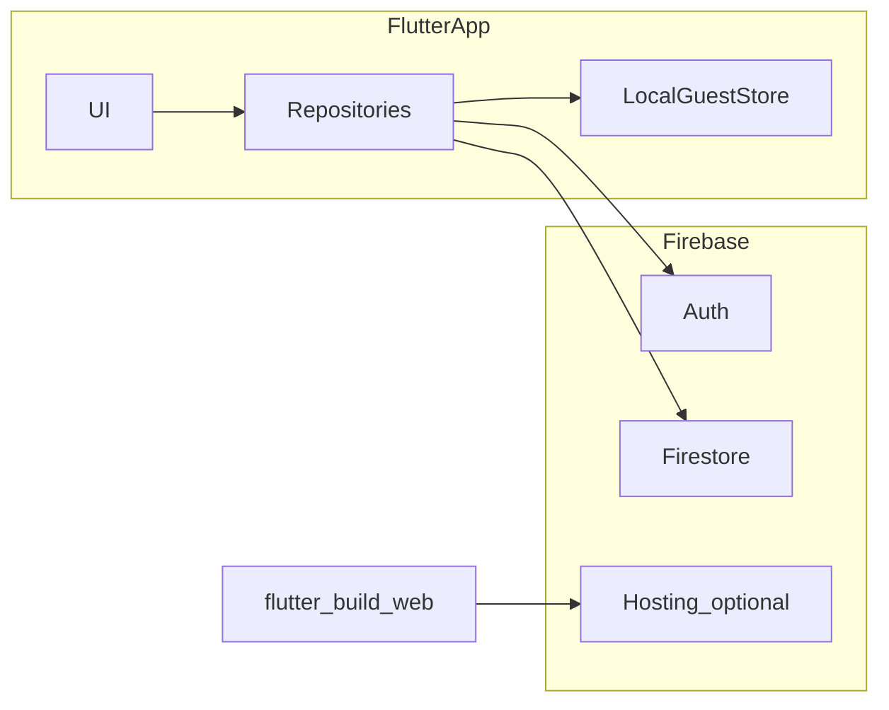

# Architecture

## Overview

- **Client**: Single **Flutter** application (targets **iOS**, **Android**, **Web**) located under [mobile/](mobile/).
- **Backend (v1)**: **Firebase** — Authentication, Cloud Firestore, and optionally Firebase Hosting for the web build.
- **No separate Ruby or custom app server in v1** unless [PRODUCT.md](PRODUCT.md) is updated to require one.

## High-level flows

### Guest

1. App loads catalog from Firestore (read-only) or from a cached snapshot when offline (behavior TBD in implementation).
2. User records wins **locally** (including run result data: wins/perfect/tier) and can attach one local screenshot.
3. Search/filter/sort is available as MVP; **Challenges** checklist progress is computed on-device from local wins + catalog (same for guests).

### Signed-in user

1. User authenticates via Firebase Auth (email/password, Google, or Apple).
2. Runs are stored under that user’s identity in Firestore (see [DATA_MODEL.md](DATA_MODEL.md)).
3. One-time migration merges local guest wins after sign-in.
4. Near-duplicate merge candidates are surfaced in a post-scan review queue for bulk user resolution.
5. Search/filter/sort and Challenges progress remain client-derived from synced runs + catalog.

### Web vs mobile

- **Same codebase**; avoid `kIsWeb` branches except for documented reasons (e.g. storage quirks, URL strategy).
- Feature parity is a **goal**; any intentional gap must be listed in [PRODUCT.md](PRODUCT.md).
- For delivery priorities and grading constraints, use [PRODUCT.md](PRODUCT.md) as source of truth.

## Repository layout (expected evolution)

Not prescriptive until implementation starts; typical shape:

- `lib/` — features (catalog, wins, auth, settings), shared widgets.
- `lib/data/` — Firestore/local adapters, DTOs.
- Optional `lib/domain/` — pure models and “won / not won” logic.

Package name may remain `mobile` until renamed in `pubspec.yaml`; coordinate renames in one pass.

## Open technical decisions

- **State management**: TBD — see [AI_CODING.md](AI_CODING.md).
- **Offline behavior**: How much catalog and win data is available offline for guests vs signed-in users — confirm when implementing.
